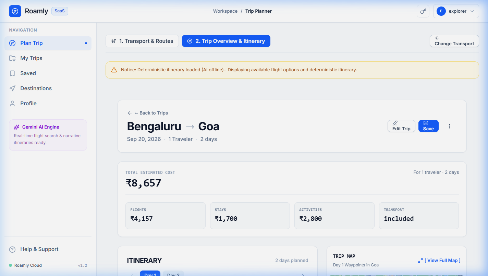
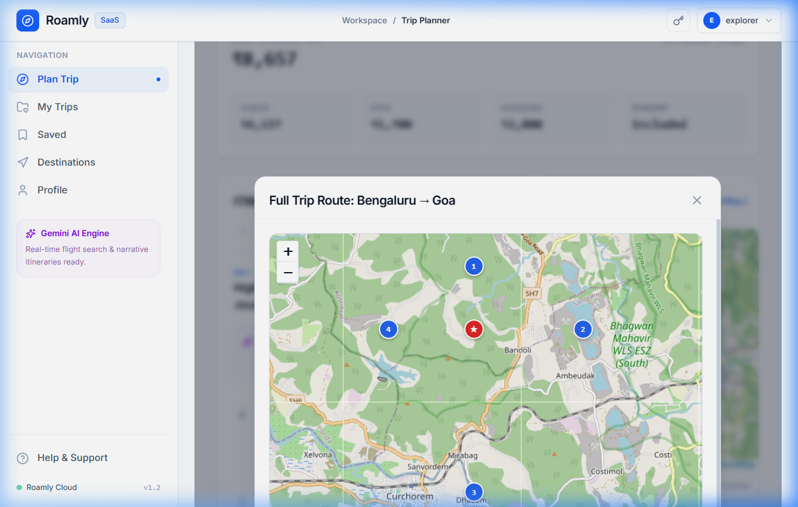
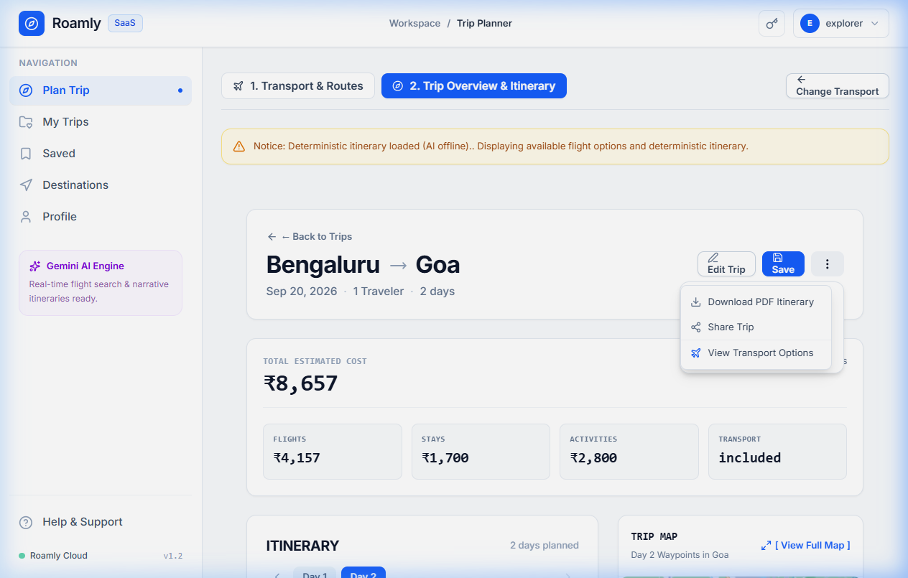
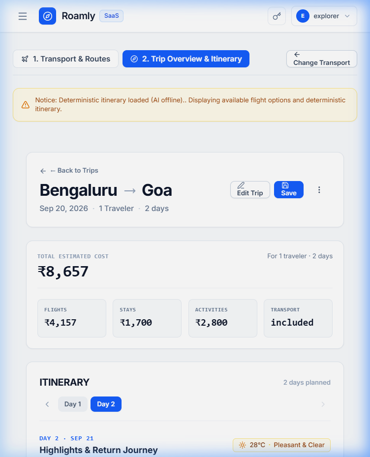
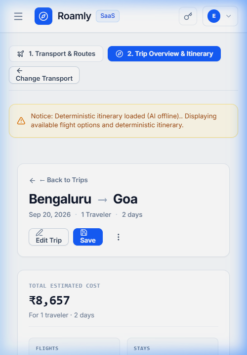
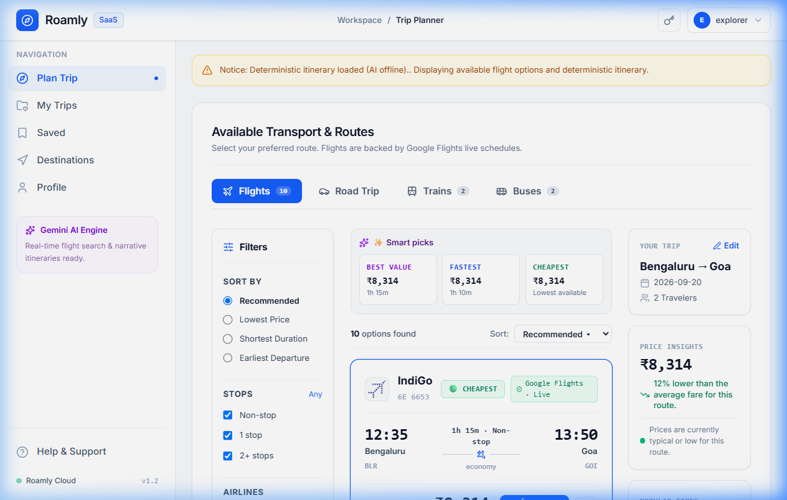
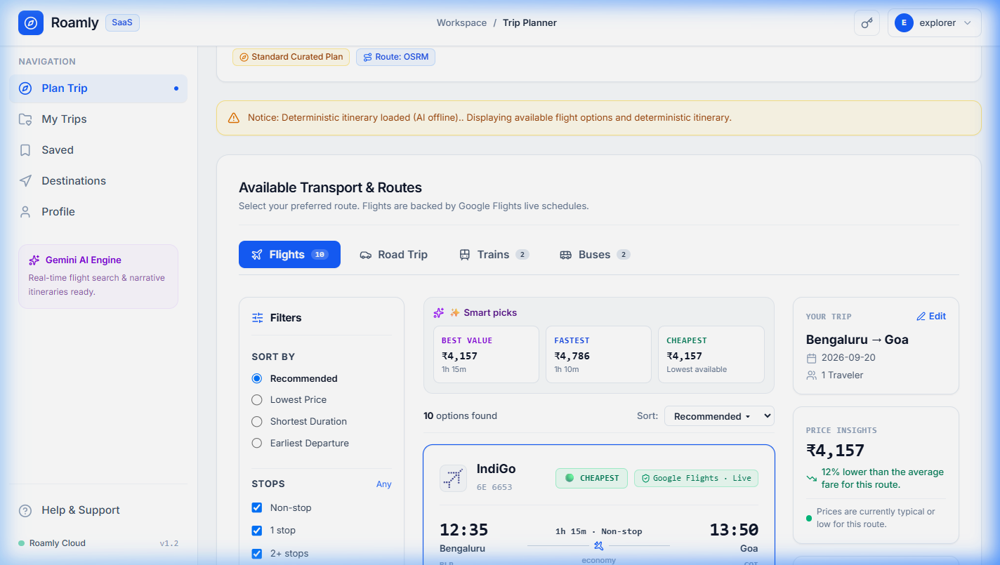
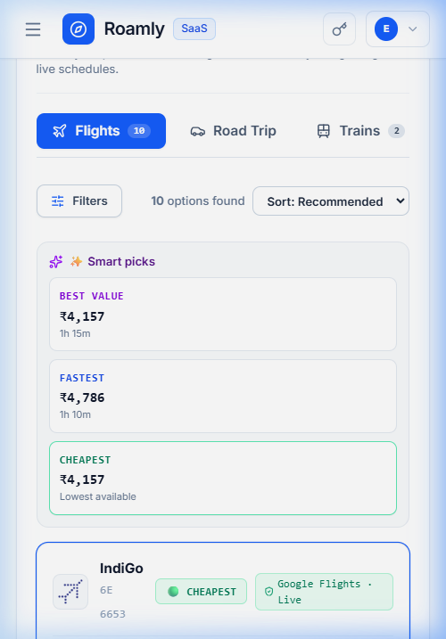
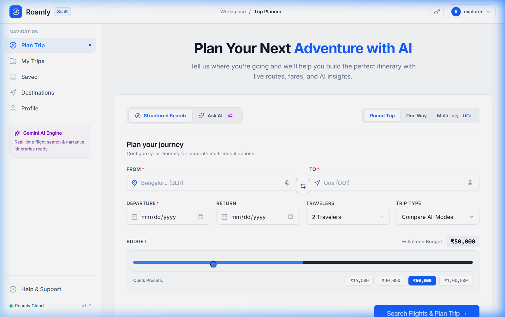
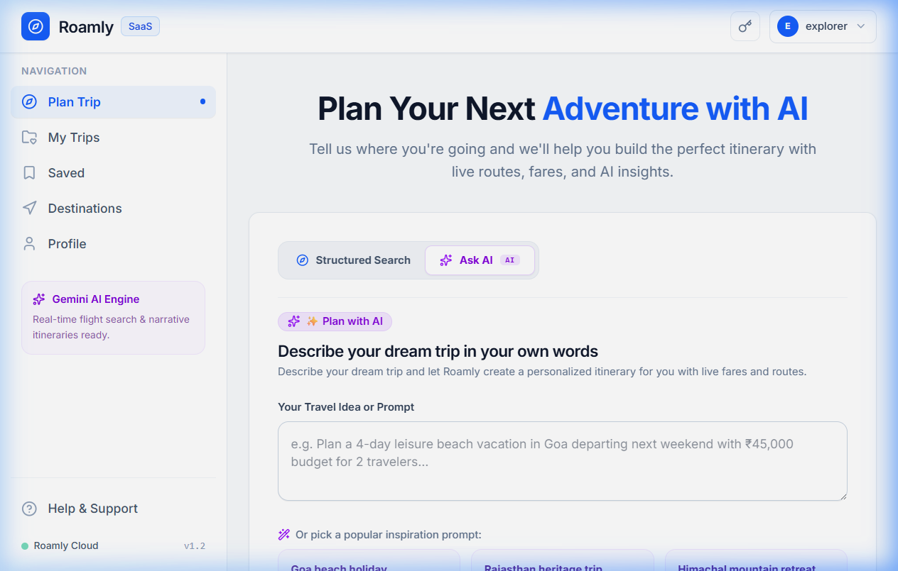

# ROAMLY — UI-3.3, UI-3.2 & UI-3.1 Walkthrough

This walkthrough documents the visual and UX implementation and verification of **UI-3.3 (Trip Overview & Itinerary Experience)**, building naturally upon **UI-3.2 (Search Results & Transport Comparison)** and **UI-3.1 (Planner Composition & UX Refinement)**.

---

## Part 1: UI-3.3 — Trip Overview & Itinerary Experience

UI-3.3 transforms the trip-detail experience into a professional travel SaaS dashboard where the traveler can immediately understand:
**Where am I going → When → How I'm getting there → What I'm doing → How much it costs.**

The experience serves as the natural continuation of:
`Plan Trip → Transport Results → Trip Overview`

### Key Architectural & UX Additions

1. **Trip Header (`TripOverview.jsx`)**:
   - `Back to Trips` navigation link with hover arrow micro-interaction returning cleanly to previous view or dashboard.
   - Clean route hierarchy: **`Origin → Destination`** (e.g. `Bengaluru → Goa`).
   - High-density metadata line: `Dates · Travelers · Duration` (e.g., `Sep 20, 2026 · 1 Traveler · 2 days`).
   - Clear primary & secondary action buttons:
     - **`[ Edit Trip ]`**: Returns traveler to planner search form with prefilled parameters.
     - **`[ Save ]` / `[ Saved ✓ ]`**: One-click trip persistence with visual feedback.
     - **`[ ⋮ ]` Overflow Menu**: Dropdown providing `Download PDF Itinerary` (client-side PDF generation via `jsPDF`), `Share Trip` (with copy link confirmation), and `View Transport Options`.

2. **Trip Summary Section (Positioned Immediately Underneath Header)**:
   - Dominant **`TOTAL ESTIMATED COST`** display with formatted amount in Indian Rupees (`₹8,657`).
   - Subtitle indicating travelers and duration context (`For 1 traveler · 2 days`).
   - **4 Compact Summary Metric Cards**:
     - **`FLIGHTS`**: `₹4,157`
     - **`STAYS`**: `₹1,700`
     - **`ACTIVITIES`**: `₹2,800`
     - **`TRANSPORT`**: `included` (or mode-aware fuel/toll sum for road trips)

3. **Left Column (Primary Content): ITINERARY Timeline**:
   - Occupies `lg:col-span-7` as the primary focal center of the 2-column desktop layout.
   - **Day Navigation**: `‹ Day 1  Day 2  Day 3 ... ›` with active pill highlighting, previous/next controls, and days planned counter.
   - **Selected Day Header**: Monospace day label (`DAY 2 · SEP 21`) with day title (`Highlights & Return Journey`).
   - **Compact Attached Weather**: Directly adjacent weather pill (`☀ 28°C · Pleasant & Clear`) providing day-specific context.
   - **Reserved AI Suggestions (`✨ AI Suggestion`)**: Strictly styled in soft purple (`bg-purple-50`, `border-purple-200`, `text-purple-900`) reserved exclusively for AI insights without polluting product blue actions.
   - **Vertical Timeline Progression**:
     - Connected vertical progression line (`w-0.5 bg-slate-200`).
     - Distinct transit node (`✈ Arrive in Goa`, touchdown & baggage claim).
     - Numbered activity cards displaying start time, activity title with category icon (dining, monument, outdoors, shopping), duration pill, cost, and rich description.
     - Final return journey node on last day (`Return Journey to Bengaluru`).

4. **Right Column (Supporting Context): TRIP MAP & Compact BUDGET**:
   - Occupies `lg:col-span-5` as supporting contextual intelligence.
   - **Interactive Leaflet Trip Map**:
     - Focuses on active day waypoints in destination city with custom numbered SVG pins.
     - Polyline route connecting chronological day stops.
     - Protected by `MapErrorBoundary` and dynamic bounds updater (`MapBoundsUpdater`).
     - Header includes **`[ View Full Map ]`** trigger.
   - **Full Map Modal Sheet**:
     - Clicking `[ View Full Map ]` opens an expanded, high-resolution modal sheet using Roamly's accessible `Modal` primitive.
   - **Compact Budget Section**:
     - Total estimated cost vs planned budget figure (`₹8,657 of ₹10,821 planned`).
     - Budget health status (`₹2,164 remaining` or `₹X over budget`).
     - Visual progress bar (`████████████░░░░░ 80%`) with dynamic color thresholding (blue < 80%, amber 80–95%, rose > 95%).
     - Category breakdown list: Flights & Transit, Hotels & Stays, Food & Activities, Local Transport & Misc.

5. **Resilient States**:
   - **Loading State**: Multi-card shimmer skeletons using `Skeleton` primitive without blocking spinners.
   - **Empty State**: Friendly *"No itinerary available yet"* card with plan trip CTA.
   - **Error State**: Reassuring *"We couldn't load this trip. Please try again."* card with **`[ Try Again ]`** and **`[ Back to Trips ]`** buttons, with zero credential or stack disclosures.

---

### UI-3.3 Visual Verification Across Viewports

#### Desktop (1440 × 900) — Trip Overview Dashboard


#### Desktop (1280 × 900) — Interactive Full Map Modal & Overflow Menu
````carousel

<!-- slide -->

````

#### Tablet (768 × 1024) & Mobile (375 × 812) — Responsive Stacking
````carousel

<!-- slide -->

````

---

## Part 2: UI-3.2 — Search Results & Transport Comparison

UI-3.2 transformed transport search results into a SaaS comparison experience (`Planner → Search → Results → Compare options → Select → Trip`).

### Key Highlights
- **TripSummaryBar**: Clean route banner `Bengaluru → Goa` with `[ Modify Search ]` and `[ Save Plan ]`.
- **240px Desktop Filter Rail**: Sort by, stops count, airlines, departure time buckets, and live price slider.
- **5-Question Immediate Card Hierarchy**: Who, When, How Long, How Much, and What do I do.
- **Semantic Badges**: `CHEAPEST`, `FASTEST`, `RECOMMENDED`, and `BEST VALUE`.
- **Mobile Action Bar & Filter Drawer (375 × 812)**: Floating filters/sort bar with zero horizontal overflow (`scrollWidth <= 375`).

#### Visual Verification
````carousel

<!-- slide -->

<!-- slide -->

````

---

## Part 3: UI-3.1 — Planner Composition & UX Refinement

UI-3.1 established the spacious `max-w-[1180px]` container, 4-column balanced logistics, unified structured vs natural language AI toggle, and image-driven destination suggestions.

#### Visual Verification
````carousel

<!-- slide -->

````

---

## Part 4: Comprehensive Verification Matrix

| Verification Suite / Tool | Scope / Focus Area | Result |
| :--- | :--- | :--- |
| `scratch/test_phase_ui3_3_overview.js` | UI-3.3 Trip Overview, Day Nav, Weather, AI Box, Map & Budget | **21/21 PASS** |
| `scratch/test_phase_ui3_2_results.js` | UI-3.2 Transport Comparison, Filter Rail, Badges, Skeletons, Modal | **22/22 PASS** |
| `scratch/test_phase_ui3_implementation.js` | UI-3.1 Planner & UI-3 Architecture Substring Contracts | **17/17 PASS** |
| `scratch/test_phase_ui3_visual_correction.js` | Tokens, credentials privacy, zero dark glass, light modal | **7/7 PASS** |
| `scratch/test_batch_review_fixes.js` | Date math, refs, modal focus trap, error sanitization | **8/8 PASS** |
| `scratch/test_phase4b_domain_integrity.js` | Geocoding, road routes, mode-aware dynamic budgets, persistence | **14/14 PASS** |
| `npm run lint` (oxlint) | Clean lint across 54 files | **0 ERRORS** |
| `npm run build` (vite) | Production build bundling | **0 ERRORS (22.59s)** |
| Real Browser (1440 × 900) | Two-column desktop layout (Itinerary + Map & Budget) | **VERIFIED** |
| Real Browser (1280 × 900) | Day navigation, full map modal sheet, overflow actions menu | **VERIFIED** |
| Real Browser (768 × 1024) | Tablet responsive stack and typography hierarchy | **VERIFIED** |
| Real Browser (375 × 812) | Mobile single-column stack, zero horizontal overflow (`scrollWidth <= 375`) | **VERIFIED** |
